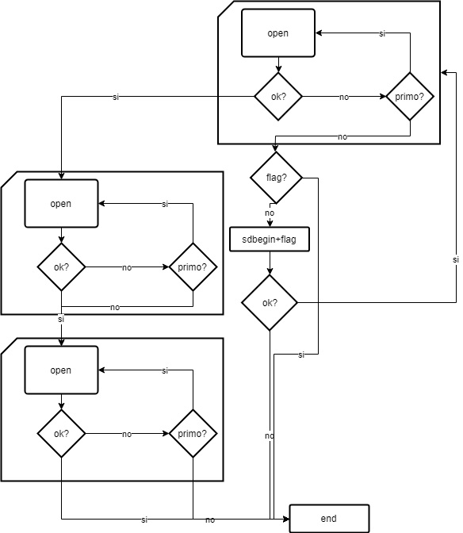

# Aquarius

My fist Arduino project, a temperature logger for an aquarium, made for a friend.\
The primary objective was resiliency: entries are written to an Sd card and transmitted through serial connection if available. If the Sd card fails or is removed, the log is stored in a temporary circular buffer, in a "condensed" state.

The temperature sensor used OneWire.

Memory usage was designed for an Arduino Leonardo, doesn't work on a Uno.

The code contains italian words as it had to be easily readable from many people.

    

